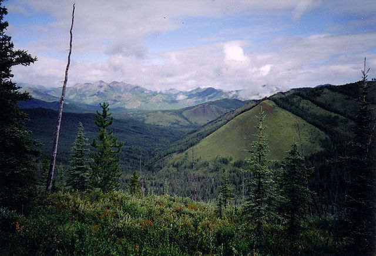

---
output:
  html_fragment    
---
```{r setup, include=FALSE}
knitr::opts_chunk$set(echo = FALSE)
```
### **Yellowstone-to-Yukon Protected Area Tour**
### **6. Muskwa-Kechika Management Area**

The Muskwa-Kechika Management Area, established in 1998, supports important populations of grizzly bears, wolves, wolverines, caribou, moose, and Stone sheep. among other species of conservation concern. A large proportion of this 64,000 sq. km. area in northern British Columbia is now designated as protected.

```{r, out.width = "60%",fig.cap="Tuchodi River. Photo credit: Wikimedia.",fig.align="center",echo=FALSE}

```

The starplot for this area suggests that climate resilience values in the Muskwa-Kechika are similar to those seen in the Rocky Mountain parks to the south. However, the Muskwa-Kechika is better connected to intact areas to the north and south, and thus it has lower threat from forward climatic velocity than seen in the Rocky Mountain parks. The Muskwa-Kechika encompasses important climate corridors. However, it holds refugia for fewer species of songbirds than do more southerly protected areas.

```{r, out.width = "90%",fig.align="center",echo=FALSE}
knitr::include_graphics("../img/6_starplot.jpg",dpi=NA)
```

<p align="center">
_Use the dropdown menu to display spatial data corresponding to each of the eight metrics in the starplot. \n<br>\nAll spatial data used in this viewer are freely available for download at the [AdaptWest website](http://adaptwest.databasin.org)_
</p>
