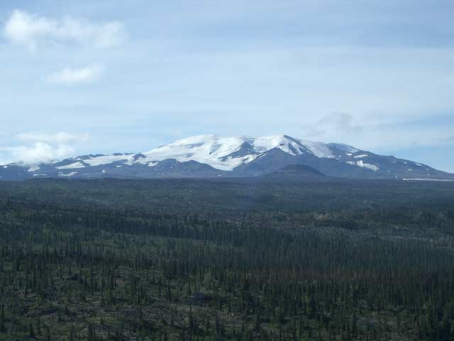

---
output:
  html_fragment   
---
```{r setup, include=FALSE}
knitr::opts_chunk$set(echo = FALSE)
```
### **Yellowstone-to-Yukon Protected Area Tour**
### **7. Spatsizi and Mount Edziza parks**
Spatsizi and Mount Edziza parks form part of the "Sacred Headwaters" region, which encompasses the sources of three important rivers of coastal BC and Alaska - the Skeena, Nass and Stikine. 

```{r, out.width = "70%",fig.align="center",fig.cap="Mount Edziza. Photo credit: Wikimedia",echo=FALSE}

```


The starplot for this area shows high values for macrorefugia based on both climate (backward velocity) and species models.
The high topodiversity of the region provides a high potential for microrefugia.
The area also encompasses important climate corridors, and forms a key linkage between coastal and interior ecosystems.
Unlike protected areas to the north and east, this region has a low potential to protect soil carbon.


```{r, out.width = "90%",fig.align="center",echo=FALSE}
knitr::include_graphics("../img/7_starplot.jpg",dpi=NA)
```

<p align="center">
_Use the dropdown menu to display spatial data corresponding to each of the eight metrics in the starplot. \n<br>\nAll spatial data used in this viewer are freely available for download at the [AdaptWest website](http://adaptwest.databasin.org)_
</p>


