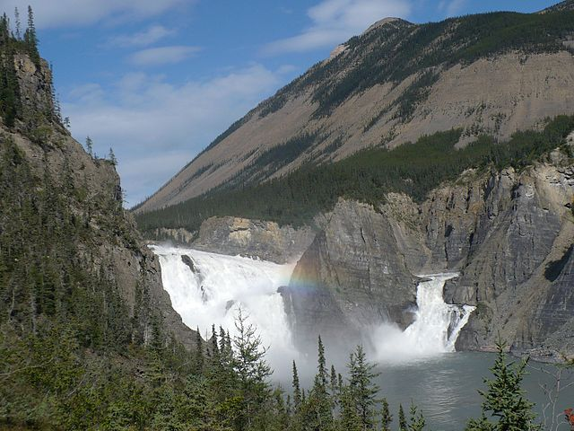

---
output:
  html_fragment    
---
```{r setup, include=FALSE}
knitr::opts_chunk$set(echo = FALSE)
```
### **Yellowstone-to-Yukon Protected Area Tour**
### **8. Nahanni**

Nahanni National Park is a 30,000 sq. km. protected area in Canada's Northwest Territories. The park, established between 1972 and 2007, is cooperatively managed by the Canadian federal government and First Nations.


```{r, out.width = "60%",fig.align="center",fig.cap="Nailicho or Virginia Falls on the South Nahanni River. Photo credit: Wikimedia",echo=FALSE}

```

The starplot for the Nahanni region confirms that the area is characterized by high intactness and low impact from development.
The montane landscape's high topodiversity gives the area high microrefugia potential.
The region also protects large amounts of soil carbon. 
The area's potential to provide macrorefugia (based on species models and backward climatic velocity) is lower than in areas to the south, due to the faster pace of climate change in boreal ecosystems. However, the Nahanni does encompass important climate corridors.


```{r, out.width = "90%",fig.align="center",echo=FALSE}
knitr::include_graphics("../img/8_starplot.jpg",dpi=NA)
```

<p align="center">
_Use the dropdown menu to display spatial data corresponding to each of the eight metrics in the starplot. \n<br>\nAll spatial data used in this viewer are freely available for download at the [AdaptWest website](http://adaptwest.databasin.org)_
</p>


